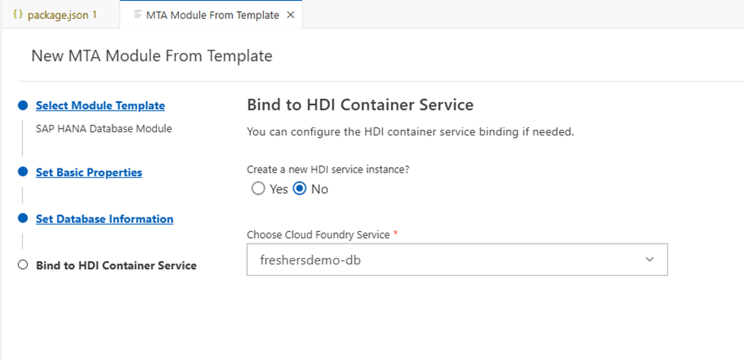

Hello there,

Welcome to my CAPM Project - Freshers Demo

Start by creating a SAP BTP trail account.
Then I have made an extensive documentation of all the steps to follow to create and start your CAPM project.

Follow these very carefully:

SAP HANA Database Creation

During the creation of your trail account, make sure you have selected the region as US, because Singapore region by default is not going to have “Hana Cloud” instance and requires you to manually subscribe to Hana Cloud in the Entitlements.

1.	Enabling to services, after checking initial setup
a.	Select Entitlements > Entity Entitlements, select your subaccount using the selection. In the services, make sure you have “SAP Hana Cloud” and “SAP Hana Schemas & HDI Container” else subscribe to them.

 
b. Enter the subaccount and enable the CF Environment if not already enabled.

  
c. Create a space(dev), if not already present.

 
 
d. Select Services > Instances and Subscriptions, if there are no subscriptions, then navigate to Services > Service Marketplace and subscribe to “SAP Business Application Studio” and “SAP Hana Cloud”.
 
 
 
 

 

e. Select the plan as “tools” while creating a Hana Cloud subscription.

 
f. One the status is Subscribed in Instances & Subscriptions, navigate to “SAP Hana Cloud”.
 

g. You will get the following error when you try to create an instance:

 
2.	Assigning Role Collections
a.	Navigate to Security > Users and select your users and click Assign Role Collection button in the detail view.

 
b.	Assign BAS role collections, if not already available.

 
c.	If you have recently subscribed to Hana Cloud, the role collections will also be created automatically and available for you to assign. Assign the Hana Cloud role collections, if you could not find the below role collections wait for a while. 
 

Sign out and sign in to BTP to get the roles reflected. 

3.	Hana Cloud Instance Creation
a.	Navigate to “SAP Hana Cloud” and create instance. If the role collections are still not reflected, try clearing the cache/ private window for the time being.

 
b.	The runtime environment should be “Cloud Foundry” (CF), hence signin and select the environment as CF.
 

 
c.	Give a instance name and make sure the system password has at least one uppercase letter, one lower case letter, one symbol, one number and length >= 9, else the HANA cloud creation will be failed with the password constraint error in the parameters.

 
d.	In connections, allow all IP addresses else you will encounter “Socket-peer error” later. If you organization does not allow you to enable this option for security reasons, then change the configuration after the instance has been created. (Stop the created instance > Manage Configuration > Edit > Allow all)

 

e.	Once created make sure the Type and Runtime are as below:
 
 

4.	HDI Container creation
a.	Wait until the Hana Cloud Instance is created and running, if you create the HDI container before then you will encounter the following error:

 
b.	In Service Marketplace, search for “SAP Hana Schemas & HDI Containers” and create instance with the following settings:
 

c.	In parameters, give the schema name of the project you are going to create. Note: Provide the same schema name later, when you add the database to your project.

 

5.	Creating CAP Project in Business Application Studio
a.	Navigate to BAS, and create a DevSpace of type “Full Stack Cloud Application” and select the extensions as shown below:

 

b.	Start the DevSpace, if it’s not in starting state.

 
c.	Create new project by using “New Project from Template”. Alternatively, if you cannot see the below screen /already have projects then navigate to File> New Project from Template.
 

d.	Select CAP Project.

 
e.	To keep the project simple, just select the project deployment as “MTA Deployment”. We will add the database from MTA file later. Adding sample is optional. 

 
f.	Once the project has been created, it will be opened in a separate workspace. If you wish to open the project separately or face any errors opening the created project, just navigate to the project folder from file.

 
6.	Dev space Login and Dependencies Setup
a.	Login in the devspace using “cf login” and get the API endpoint from the BTP cockpit > Overview > CF Environment. If you have only one organization and space they it will be selected automatically else choose the organization and space required.
 
  

  

 
 
b.	Modification of package.json in the root folder.

 
c.	Set the official registry for node modules and install them in order to avoid most kind of node module errors.

7.	Adding Database to your Project (Binding HDI Container)
a.	Delete the existing db folder as we are going to add it from the mta file.

b.	Now to create the db folder, right click mta and select Create MTA Module from Template

 

c.	Continue with below process. Note: Either give the module name as the hdi container name now or change it later (from db to your hdi-instance name) in the mta file
 
 

 
d.	In the Database information, enter the same schema name which you have given during HDI container creation.

 
e.	As we have already created the HDI container, select the created one.

 
8.	Adding Entities and Exposing them in Service layer
a.	In your db folder, add a file with cds extension. The best practice is to name this file either tables/schema.

 
b.	In order to expose your created entities, create a service.cds file in your srv folder.
 

9.	Hybrid testing and deployment
a.	For testing your exposed APIs in your service layer, we have two ways. 
i.	Using a default-env.json file your root folder by copying it from env of db. Then you will be able to run the application using “npm start” or “npm run”.
ii.	Hybrid test: Bind your db using “cds bind -2 freshersdemo-db” then a cdsrc-private.json should have been created. Then you will be able to run the application using “cds watch –profile hybrid”.

 
b.	Build the application using “cds build” and deploy it using “cds deploy”. Then the created the entities will be added to the database.

c.	Open the DB Explorer under the 'SAP Hana Projects' to add data.

 
d.	Add data either using the ‘+’ or sql-hana queries.

 
e.	Once the data is added run the application according to testing method opted.
 

 

